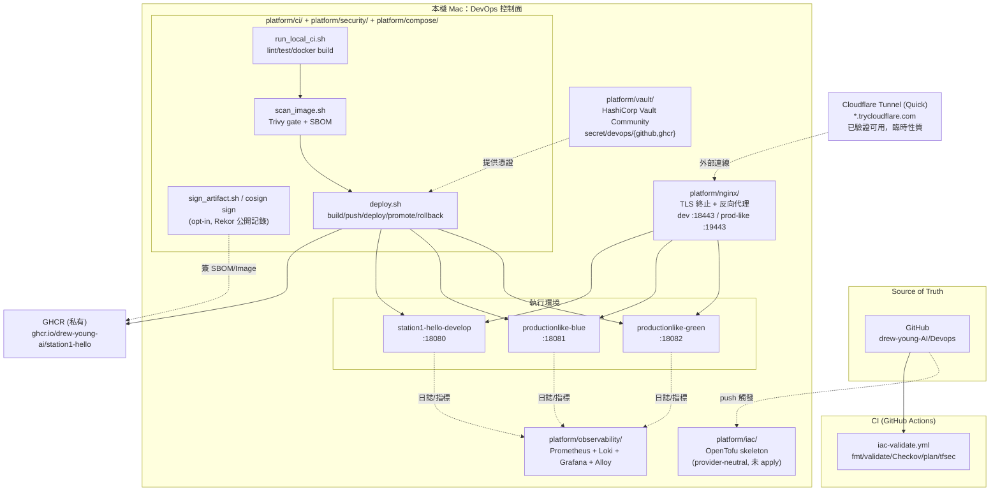
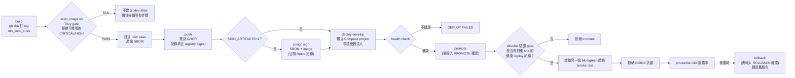
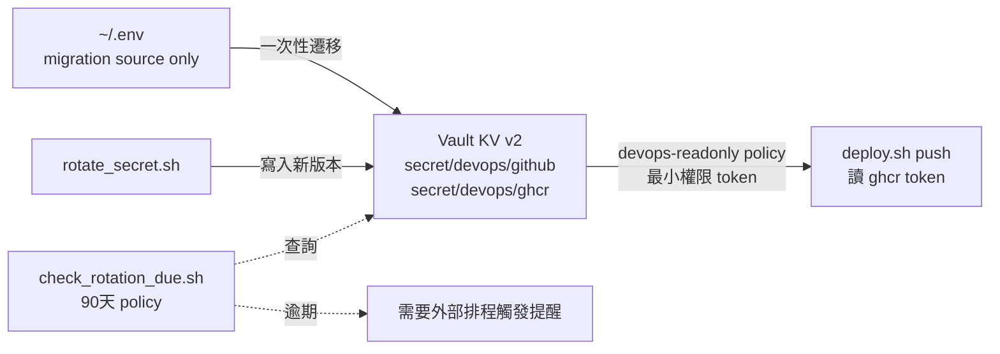
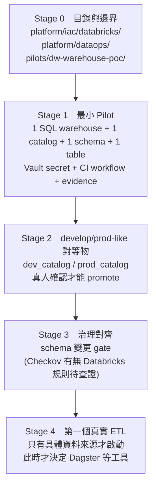
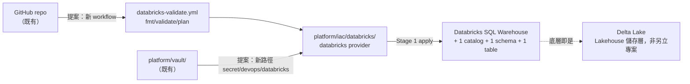

# DevOps 平台階段性 Review

- **第二次 review：2026-08-18**（見文末 §9，涵蓋 ingress、有狀態 pilot、
  migration gate、公衛 twin、k3d 練習叢集）
- 第一次 review：2026-08-11（以下 §1–§8）

本文件是目前實際建置狀態的快照，給討論下一步用。詳細規格與逐項驗證證據見
`Plan.md`（交接狀態權威來源）與各 `platform/*/README.md`。

---

## 1. 整體架構（已建置）

**邊界規則**（未變）：`platform/` 不依賴特定 Pilot 業務邏輯；`pilots/` 可使用
platform 提供的能力。目前唯一 Pilot 是 `station1-hello`（Python stateless
hello world）。

---

## 2. Build → Deploy 流程（單一 Pilot 的完整生命週期）

**關鍵設計**：
- 每一步都寫 evidence（`evidence/<pilot>/*.json`），大檔案（Trivy 原始掃描、SBOM 原始檔）本機保留但 gitignore，只 commit 精簡摘要
- `promote`/`rollback` 是真人互動確認（`read -p`），沒有 `--yes` 旁路
- Blue/Green 用不同 host port（18081/18082），同一份 image，不重 build

---

## 3. Secret 流程

`secret/devops/github`（fine-grained，git push 用）與 `secret/devops/ghcr`
（classic + write:packages，registry push 用）刻意分開存放——兩組憑證用途不同，
即使背後是同一個 GitHub 帳號。

---

## 4. 目前完成狀態

| 層 | 元件 | 狀態 |
|---|---|---|
| Source control | GitHub repo | ✅ |
| CI | GitHub Actions（IaC 驗證） | ✅ |
| IaC | OpenTofu skeleton（provider-neutral，未 apply） | ✅ 契約完成，未接雲端 |
| 網路 | NGINX（本機 HTTPS，dev + prod-like 各一個 vhost） | ✅ |
| 部署 | Compose adapter（develop / blue-green / rollback） | ✅ |
| Secret | Vault（migration + rotation policy） | ✅ |
| 安全 | Trivy gate / Gitleaks / SBOM / Cosign（SBOM + image） | ✅ |
| Registry | GHCR（private） | ✅ |
| 觀測性 | Prometheus / Loki / Grafana / Alloy | ✅（Phase 0 既有） |
| Public URL（免帳號快速方案） | Cloudflare Tunnel Quick Tunnel | ✅ 已實測，端到端打通（見下方驗證記錄） |
| Public URL（固定網址/正式方案） | Cloudflare 具名 tunnel 或 rathole + Cloud VM | ⛔ 待決定：要不要固定網址、要不要雲端供應商 |
| Pilot 驗收 | Technical validation + Human Usability Review | ⛔ 需要人類親自使用評估 |
| K8s / MLOps | — | 刻意延後（Plan.md 明確排除本階段範圍） |
| **資料架構**（Warehouse/Lakehouse/DataOps） | — | 🗣️ 討論中，尚未動手，見第 8 節 |

**Public URL 驗證記錄（2026-08-11）**：`cloudflared tunnel --url https://127.0.0.1:18443`，
免帳號、免網域，數秒內取得 `*.trycloudflare.com` 網址。從外部 curl `/health/ready`、`/version`
皆正確回應，NGINX access log 直接看到外部 host header，證明完整鏈路（Cloudflare edge → 本機
NGINX → pilot 容器）真的打通。測完即關閉（Quick Tunnel 為臨時性質，不留無人看管的公網暴露）。

---

## 5. 目前的已知限制（誠實列出，不是藏起來）

- SBOM 簽章非 content-stable：Trivy 每次重新產生 SBOM 的 timestamp/serialNumber
  都不同，導致 `SIGN_ARTIFACTS=1` 幾乎每次 build 都會產生新的 Rekor 公開記錄
- Secret rotation 沒有自動提醒機制，`check_rotation_due.sh` 要靠外部排程觸發
- `push`/`promote` 之間沒有互相 gate（push 完不強制要求先 promote 過的 image
  才能 deploy，兩者目前是獨立步驟）
- 只有一個 Pilot（station1-hello），platform 的「多 Pilot 共用」假設還沒被
  第二個服務驗證過
- **Docker Desktop 重啟後，所有容器會全部停止，需要手動拉回**：Vault 需要重新
  `init_and_unseal.sh`（資料有保留，Cluster ID 不變，但每次都要重新解封）；
  develop/production-like/nginx 也要重新 `deploy`/`docker compose up`。目前
  沒有開機自動拉起的機制
- Kubernetes、MLOps/LLMOps、真實多節點 HA：明確排除在本階段外

---

## 6. 討論用的開放問題（DevOps 平台本身）

1. **下一個 Pilot** 要做什麼？（驗證「platform 是否真的可重用」的關鍵測試——
   資料架構的 Stage 1 Pilot 有機會直接扮演這個角色，見第 8 節）
2. **Registry promotion 的 gate** 要不要收緊——例如強制 `deploy develop` 前必須先
   `push` 過？
3. 要不要開始寫 `platform/runbooks/`（目前完全空）？deploy/rollback/incident
   的操作手冊现在都只存在於各 README 的敘述文字裡，沒有獨立的 runbook 格式
4. Docker Desktop 重啟後的手動拉起流程，要不要寫成一個 `platform/runbooks/restart_stack.sh`？

---

## 7. Public URL：免費方案結論

在還沒有 GCP/Azure/AWS 帳號之前，**Cloudflare Tunnel 已經是可行的免費方案**，
不需要等雲端供應商決策：

- **臨時測試**：Quick Tunnel（上面驗證過的），零帳號零網域，網址每次重啟會變
- **固定網址**：免費 Cloudflare 帳號 + 一個已有的網域，`cloudflared tunnel create`
  建立具名 tunnel——這個還沒做，要做隨時可以繼續
- rathole + Cloud VM 仍是 `docs/Network.md` 的主方案，但不是「現在唯一能用的
  路」——這點跟原本的規劃認知不同，值得更新 `docs/Network.md` 的優先序

---

## 8. 資料架構討論（Data Warehouse / Lakehouse / DataOps）

### 8.1 背景

老闆的命題：DataOps（含 Warehouse、Lakehouse、DataOps 本身）三個目的要一起考慮，
提到會用 Databricks，但沒給需求或規模。目前結論：**先有個開始，再擴充**，仿照
`station1-hello` 驗證 DevOps 平台骨架的同一套邏輯，去驗證資料架構骨架。

### 8.2 框架：兩個軸，不是一件事

- **軸一（資料放哪裡查）**：Data Warehouse（schema-on-write，BI 導向）vs Data
  Lake（schema-on-read，便宜但治理弱）vs Lakehouse（Delta Lake 統一兩者，
  Databricks 的核心賣點）。企業「被迫走兩套工具」的根源正是 Warehouse/Lake
  分離；Lakehouse 存在的理由就是解這個問題。
- **軸二（流程紀律）**：DataOps——pipeline 怎麼測試/版控/部署/回滾/核准，
  跟軸一選什麼儲存無關，是操作紀律不是產品。

**結論**：選 Databricks 做 Warehouse，Lakehouse（Delta Lake）是附帶的儲存層，
不用另外立項；DataOps 的「怎麼做」延伸現有 GitHub Actions + Vault + evidence
模式，不用 Databricks 原生 Workflows 當主控。

### 8.3 被推翻的方案：Databricks + ETL + Kafka + Redis + 戰情

討論過程中曾提出這個組合，已被推翻，理由留存：

- **和「三合一不切實際」的結論自相矛盾**：從 1 個平台變成 5 個工具，只是把
  複雜度換位置，不是減少
- **Kafka 必要性未證明**：沒有明確的高吞吐/多消費者串流場景，很可能是
  「聽起來先進」而非真需求；若資料其實是批次的，Dagster/Airflow 排程即可
- **Redis 用途未定義**：若只是快取 Databricks SQL 查詢結果，Databricks SQL
  本身已有查詢快取層，額外加 Redis 等於重現「兩份資料對不齊」的老問題
- **「戰情」名稱與架構延遲互相矛盾**：戰情室意涵秒級新鮮度，但 Lakehouse
  路徑天生是分鐘級延遲（micro-batch、compaction）；若真要秒級，需要完全
  不同的架構（Kafka Streams/Flink 直接寫入 Redis 或 ClickHouse/Druid），
  比原方案更複雜
- **便宜替代方案**：Redis Streams 本身可當輕量事件匯流排（不必額外裝
  Kafka）；戰情儀表板直接用**既有的 Grafana**（`platform/observability/`
  已在跑，加一個 Databricks SQL data source 即可，不必新建平台）

### 8.4 建議的分階段路線圖（尚未建置，討論用）

**每個 Stage 都只做上一個 Stage 驗證過的東西 + 一小步**，不預先蓋大架構。
Stage 1 的唯一目的：驗證「Vault 存的 token 能不能讓 CI 對 Databricks 做
Terraform plan/apply」，不是做出有意義的資料模型。

### 8.5 Stage 1 如何接進現有架構（提案，尚未建置）

沿用既有的 provider-neutral IaC skeleton（`platform/iac/providers.tf` 本來就
留了雲端 provider 的註解區塊）、既有 Vault policy（`devops-readonly` 的
wildcard 直接涵蓋新路徑，不用改 policy）、既有 CI pattern（複製
`iac-validate.yml` 的 fmt/validate/plan 骨架）。**不會**直接套用
`platform/compose/deploy.sh` 那一整套，因為 Warehouse 是 managed cloud
service，沒有容器可以 build/push/swap——複用的是**模式**（evidence-driven、
develop-gate、真人核准），不是機制本身。

### 8.6 尚待查證/確認

- Databricks Free Edition 的 workspace-level REST API / CLI / Asset Bundles
  部署，官方文件沒有明確列在限制清單內，但也沒明確確認可用——需要實測
- Checkov 是否已有 Databricks 相關的 policy 規則可直接套用
- IBM 與 Databricks 的關係查證：**未找到 IBM「放棄」Databricks 的證據**，
  查到的相反——IBM 目前是 Databricks Gold partner，2026/8 前剛拿到新的
  Brickbuilder Specialization。IBM 有自己的競品 watsonx.data，2024 年
  IBM Think 上曾拿自家 Presto C++ 引擎對比 Databricks Photon（宣稱同效能
  60% 成本），這可能是「放棄」說法的來源——正確描述是「合作又競爭」，不是
  「放棄」

### 8.7 值得帶回去問老闆的問題

1. Warehouse 的消費者是誰——BI 分析師手動查，還是要接某個報表/儀表板？
   （決定 warehouse size、要不要額外快取層）
2. 資料來源是內部系統匯出，還是要接外部 API/資料庫？（決定 Stage 4 的 ETL 形狀）
3. 「老闆提到 Databricks」是已經有 license/帳號，還是也在評估中？
   （若還在評估，Stage 1 可以先用 Free Edition，不急著用掉正式 license 額度）

---

## 9. 第二次 Review（2026-08-18）

第一次 review 之後的十個 commit。這一輪的主題不是「加功能」，而是**發現既有
機制其實沒在運作**——三次都是「檢查通過、機制沒作用」的同一種形狀。

### 9.1 三個「看起來在運作、其實沒有」

| 機制 | 表面狀態 | 實際 | 怎麼發現的 |
|---|---|---|---|
| 排程（6 個日/週任務） | 全部「最近成功」 | **`runs = 0`，launchd 從未觸發過**，紀錄全是手動執行 | 追查 DAG 變紅 |
| 備份覆蓋率 | `BACKUP PASS` | station2-twin 的 volume **不在任何清單**，仍回報成功 | 建立第一個有狀態服務 |
| 測試套件自身 | `0 failed` | 兩個拼錯的 helper **靜默跳過**，斷言從未執行 | 自己打錯字 |

共同點：**清單、log 訊息、exit code 都無法回報自己缺什麼。** 修法一律是把
「宣稱」換成「觀測」——排程加執行來源溯源（`XPC_SERVICE_NAME`）、備份加
全域 volume 覆蓋率掃描、測試加未定義 helper 靜態掃描。

### 9.2 Public URL：卡住的是錯誤前提，不是缺決策

`Plan.md` 掛了數週的「rathole/Cloudflare 需要人類決定雲端供應商」——不需要。
所有服務綁 127.0.0.1，Tailscale 在 host 上直接可達 loopback。不開 router
port、不設 inbound 規則、不需要雲端帳號。

`platform/ingress/` 的設計重點是**暴露天花板**：依「靠什麼驗證」決定，不依
「名字聽起來多敏感」。prometheus / loki / alertmanager / vault 一律 `never`。
alertmanager 最尖銳——`/api/v2/silences` 是寫入端點，碰得到就能無聲關掉監控。

⚠️ 測試套件自己曾把 Vault 暴露到 tailnet 上（約兩分鐘，已移除並確認不可連）：
refusal 測試跑的是**正式設定**，而我為了驗證防護把 vault 天花板暫時提高，
於是套件真的執行了那個操作。現在測試跑在指向死埠的 fixture 上，正式設定只讀
不執行。

### 9.3 Station 2：有狀態服務與 migration gate

平台第一個有狀態服務（PostgreSQL）。關鍵設計是 **readiness ≠ liveness**：
Docker healthcheck 只打 `/health/live`，接 readiness 會讓資料庫一抖就重啟
所有 replica，而重啟修不好資料庫。

`platform/db/migrate.sh` 拒絕三件事，皆以注入驗證：套用後被修改的 migration
（checksum 不符）、未標記 `CONTRACT-PHASE` 的破壞性變更、半套用（單一 transaction）。

第二項的理由具體：blue/green 共用同一個資料庫，舊顏色還在服務時 `DROP COLUMN`
等於毀掉回滾目標——部署在最需要能倒回去的那一刻變成不可逆。

### 9.4 公衛 CDC 監測：pilot 的真實負載

疾管署 RODS 急診監測開放資料，109,907 列、2007→2026、22 縣市、**無 PHI**。

在此之前 station2-twin 只是「有 twin 之名的狀態儲存」。**twin 的第 4、5 要素
（模型、背離偵測）到這一步才存在**：歷史同週分布是模型，當期是觀測，兩者的
差距就是疫情訊號。方法用 historical limits（同 ISO 週 ±1、前 5 年、mean ± 2sd），
是公衛實務界既有方法，長官一句話能聽懂。

2026-W32 實測：2/22 縣市超出歷史上限（宜蘭 z=2.49、南投 z=2.16），嘉義市
z=1.07 未告警。**它不亂叫**，這是偵測器最重要的性質。

過程中的真實缺陷：疾管署伺服器**送錯中繼憑證**（leaf 的發行者與伺服器送出的
中繼是不同的 CA），瀏覽器靠 AIA 自動補抓所以看不出來。解法是釘住正確中繼，
不是 `verify=False`——這個 job 的輸出是「官方通報數字」。

### 9.5 目前完成狀態（相對 §4 的增補）

| 層 | 元件 | 狀態 |
|---|---|---|
| Ingress | Tailscale serve + 暴露天花板 | ✅ tailnet 已用；funnel 待 admin console 啟用 HTTPS |
| 資料庫 | PostgreSQL + migration gate | ✅ 四項注入驗證 |
| 有狀態 pilot | station2-twin | ✅ 四種 readiness 狀態實測 |
| 真實負載 | CDC RODS 公衛監測 | ✅ 11 萬列，冪等 ingest，證據鏈 |
| Twin 模型 | historical limits 背離偵測 | ✅ 2/22 告警 |
| 排程 | launchd 日曆觸發 + 來源溯源 | ⚠️ 已修正，**首次真實觸發待觀察** |
| K8s | k3d 3 節點 + Calico + kube-prometheus | ✅ 練習環境；NetworkPolicy 四向驗證 |
| 異地備份 | rclone crypt | ⏸ 機制完成，使用者決定保留討論 |

### 9.6 下一步

1. Spark 回放 pipeline（**誠實定位**：11 萬列不需要 Spark，它是 CYCH 自家
   急診即時 feed 的架構預演）
2. k3d 叢集重建（真 StorageClass + registry）→ pilot 上 K8s
3. Kubeflow Pipelines standalone
4. Vault 動態資料庫憑證（**建議插隊先做**——Vault 側設定與底層無關，
   100% 帶得走）
