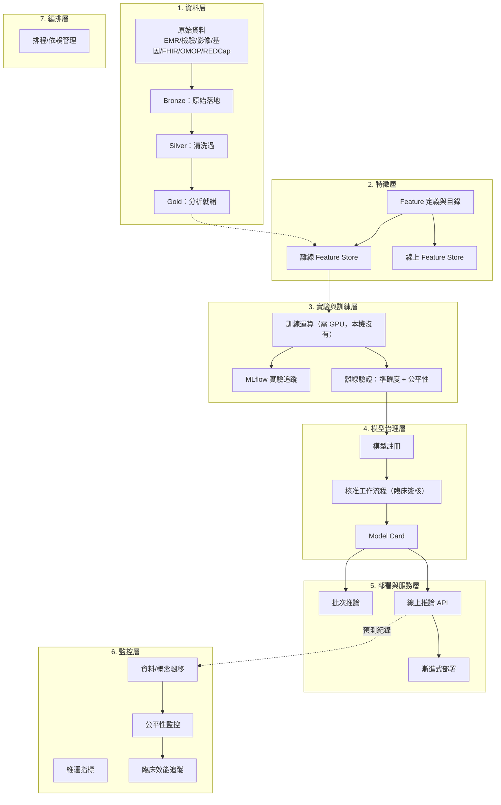

# Future DataOps — Medical & Multi-Modal Data

This is deferred, same as `Future-ML-LLMOps.md`. Keep the architecture able
to grow into this; do not build the full data platform now. Written from
the actual job scope (2026-08-11): AI 醫療、數位健康、臨床決策支援，需整合
EMR、檢驗、醫療影像、基因、RWD、FHIR/OMOP/REDCap/Databricks。

**2026-08-11 更新**：討論結論改變——MLOps/DataOps 應該是**獨立於這個
`Devops` repo 的另一個 repo**，不是這個 repo 的子目錄。本文件其餘內容
（資料種類對應、PHI gate、模型類型等）仍然有效，但任何提到「在
`platform/iac/databricks/` 底下建」這類「長在這個 repo 裡」的敘述，都要
理解成「未來那個獨立 repo 裡的對應物」，不是這裡。原因與邊界劃分見下。

## Repo 邊界決策：獨立，但透過明確服務介面耦合

**為什麼獨立**：
- 「完成」的定義不同——DevOps 是 pipeline 綠燈/部署成功；MLOps/DataOps 是
  模型驗證過、drift 在可接受範圍、資料品質過關，兩者混在同一個 `Plan.md`
  只會互相干擾進度追蹤（這件事已經實際發生過一次）
- 監控週期不同——DevOps 是秒級 health check；MLOps 的 drift/效能監控是
  天/週級，兩者不該用同一套 gate 邏輯
- 未來貢獻者不同——DevOps 現在是你一人；MLOps/DataOps 明確會有「資料科學家、
  臨床研究人員、雲端工程師」加入

**為什麼不是完全獨立、而是透過服務介面耦合**：從零重建 Vault/CI/Registry/
Observability 會浪費這幾週驗證出來的紀律（evidence-driven、真人確認 gate、
最小權限 secret），而且維護成本重複。正確模式是：**這個 Devops repo 扮演
platform-as-a-service 提供者，MLOps/DataOps repo 是消費者**，透過下面這張
表定義的介面耦合，不共用程式碼庫。

| 共用服務 | MLOps/DataOps repo 怎麼用 | 不共用的部分 |
|---|---|---|
| Vault（`platform/vault/`） | **已建置並驗證**：`secret/dataops/*` namespace + `dataops-readonly` policy，4 項邊界測試通過（含跨 namespace 隔離：dataops token 讀不到 `secret/devops/*`）。詳見 `platform/vault/README.md`「DataOps Namespace」。未來 repo 直接用 scoped token 讀，不碰 root token | 自己的 secret 內容 |
| GHCR（同一 GitHub 帳號） | 新 image namespace（例如 `ghcr.io/drew-young-ai/dataops-*`） | 自己的 image 內容 |
| Observability（`platform/observability/`） | 算好的指標（drift 分數、feature 健康度）推進同一個 Prometheus/Grafana 顯示，本機同一台 Mac 上直接打 `127.0.0.1:19090`/`127.0.0.1:13100` 即可，不需要額外網路設定 | 指標怎麼算（統計邏輯）、原始資料本身 |
| CI/evidence **模式**（不是程式碼） | 抄 `deploy.sh`/`scan_image.sh` 的設計模式（build→scan→push→deploy→evidence、真人確認 gate）寫自己的版本 | 實際腳本內容、`Plan.md`、evidence schema 細節 |
| 部署機制（`platform/compose/deploy.sh`） | 如果模型服務是「容器化的 API」，理論上可以直接複用（第 5 層「部署與服務」，見下方參考架構） | 需要先驗證 `deploy.sh` 對任意服務是否真的通用，尚未驗證 |

## 參考架構：七層（不是只有 Warehouse/Lakehouse/DataOps 三塊）

一個完整的 MLOps/DataOps 參考架構要涵蓋的層次，每層有自己的關注點、自己的
失敗模式、自己該由誰把關：

**跟 DevOps 平台複用度最高的是第 5 層**——線上推論服務本質上是「容器化的
API」，`platform/compose/deploy.sh` 的 build→scan→push→deploy→promote→
rollback 機制理論上可以幾乎直接套用，只是部署對象從 station1-hello 換成
模型服務。其餘六層（資料、特徵、訓練、治理、監控邏輯、編排）都是 MLOps/
DataOps repo 自己要建的東西，跟 DevOps 平台無關。

### 每層的醫療特有考量（不是通用 ML 就能套）

- **資料層**：PHI 去識別化必須發生在 Bronze→Silver 轉換點
- **特徵層**：point-in-time 正確性是臨床預測模型最大的資料洩漏來源
  （用了診斷後才有的檢驗值去預測診斷本身）
- **訓練層**：離線驗證除準確度外，必須包含跨病人族群（性別/年齡/族裔）的
  公平性檢查——FDA SaMD 框架會直接檢查這項
- **治理層**：模型核准不能只是技術指標達標，需要臨床端簽核；Model Card
  建議現在就定格式規範
- **部署層**：漸進式部署要比一般軟體更保守——可能需要先在非診斷輔助情境
  下並行觀察一段時間，才能真正影響臨床決策
- **監控層**：公平性監控是持續合規義務，不是 nice-to-have；臨床效能追蹤
  需要真實臨床結果回饋，時間尺度是數月到數年，跟其他監控完全不同量級

## 兩個真正卡住、需要老闆/組織決策的硬缺口

七層裡，只有以下兩項不是「延後就好」，是會卡住整個架構往前走的：

1. **GPU/訓練運算資源**——本機 Mac 完全沒有，這會逼出雲端供應商決策，
   跟 rathole 卡住的是同一類問題（雲端供應商），只是被另一個理由（訓練
   算力，不只是 public URL）再次逼出來
2. **模型核准的權限模型**——現有 DevOps 的單人 Vault 模式完全不夠用，
   誰能核准模型上線不該是純技術決定，需要真正的多人角色設計

## 現在（不需要問老闆）可以做、但刻意不做的準備工作

以下是技術上不需要老闆決策、但因為「不是一直擴大」的紀律，目前刻意不做，
列出來是為了不要之後又重新討論一次：

- Vault 開 `secret/dataops/*` 路徑 + policy（複製 `devops-readonly` 模式）
- `platform/observability/` 加 Prometheus Pushgateway（給批次 job 用，
  drift 計算這類跑完就結束的 job 沒有東西可以被動 scrape）
- 寫一份 `docs/Platform-Interfaces.md`，把上面的服務介面表正式規格化
- 驗證 `platform/compose/deploy.sh` 是否真的對任意 Dockerized 服務通用
  （還是有隱性假設綁死在 station1-hello 上）

**觸發條件**：MLOps/DataOps repo 真的要建立、Stage 1 要開始時，才回來做
這四項，不是現在。

## What belongs in this platform vs. what doesn't

`platform/` provides reproducible, auditable, secure **infrastructure** —
storage, compute environments, deployment, versioning, evidence trail. It
does **not** provide the science itself.

| In scope for `platform/` | Not in scope — belongs to the researcher's own code/notebooks |
|---|---|
| Secure, governed data access | Which statistical test to run |
| Reproducible Python/R/SQL environments | Feature engineering logic |
| Model deployment, versioning, inference serving | Model architecture choices |
| Data quality/standardization pipeline scaffolding | Clinical trial matching algorithm design |
| Audit trail for model validation/performance | Report content, research writing |

If this line gets blurry in practice, default to: platform owns the
*contract* (schema, evidence format, deployment gate), the Pilot/notebook
owns the *content*.

## 資料種類 → 儲存/處理層對應

| 資料類型 | 特性 | 建議層 | 現況 |
|---|---|---|---|
| EMR / 結構化病歷、檢驗資料 | 表格式，schema 明確，常有 LOINC/ICD 編碼 | Data Warehouse（Databricks SQL 或既有 Postgres 模式） | `STAGE_REVIEW.md` §8 Stage 1 討論已涵蓋，尚未建置 |
| 醫療影像（DICOM） | 大型二進位，需 PACS-like 存取 | MinIO（S3-compatible，`docs/IaC.md` 已決定）或 Databricks Unity Catalog Volumes | 尚未建置——兩個選項互斥的取捨見下 |
| 基因資料（VCF/BAM/CRAM） | 極大檔案、特殊格式，常需要 GATK 等專門 pipeline | MinIO + 專門運算環境（GPU/高記憶體） | 尚未建置，需要雲端運算資源決策（跟 rathole/Cloud VM 是同一個「還沒決定雲端供應商」的缺口） |
| RWD / 多模態 | 混合上述 | 依內容拆分到對應層，不強求單一格式 | — |

**MinIO vs Databricks Volumes 的取捨**（尚未決定，先攤開）：
- MinIO：自架、便宜、跟現有 provider-neutral 哲學一致，但治理/權限要自己接
- Databricks Volumes：跟 Unity Catalog 治理/權限整合緊密，但等於把非結構化資料也押進 Databricks 生態——跟先前「不要一個平台混三種目的」的結論有點張力，值得在真的要做 Stage 1+ 時重新拿出來討論，不是現在決定

## 標準/工具整合（FHIR、OMOP、REDCap）

- **FHIR**：醫療互通標準（HL7 FHIR），需要 FHIR server 或 API adapter 把資料轉成/讀出 FHIR resource
- **OMOP**：OHDSI 的共通資料模型，通常是把既有資料 ETL 轉換成 OMOP CDM schema，方便跨機構研究比對
- **REDCap**：臨床研究資料擷取工具，通常透過 REDCap API 匯出

這三個都不是現在要建的元件。它們會在 `STAGE_REVIEW.md` §8.4 的 **Stage 4**（第一個真實 ETL，只有具體資料來源出現才啟動）決定要接哪一個、怎麼接——現在先知道「這三個是候選的資料進出口」就夠了。

## 資料治理／PHI 安全 — 這條不能拖到 Stage 4 才處理

現有的 evidence-driven 模式（`evidence/<pilot>/*.json`，commit 進 git）目前假設
「寫進 evidence 的東西都不敏感」——這個假設在有真實病人資料流過 pipeline 之前
**必須重新檢查**，不是可以無限期延後的項目：

- [ ] 確認 evidence 產出流程不會意外把 PHI（病歷號、身分證號、可識別欄位等）
      寫進 commit 歷史或 evidence JSON——現有欄位（timestamp、digest、
      commit sha）本身安全，但一旦 Pilot 開始碰真實資料，需要明確規則界定
      「什麼可以寫進 evidence，什麼絕對不行」
- [ ] `platform/security/scan_secrets.sh`（Gitleaks）抓的是 secret pattern
      （token/key），不是 PHI pattern（病歷號/身分證號等）——需要評估要不要
      加一層獨立的 PHI 掃描規則，或至少在 runbook 裡明確寫「Gitleaks 不會
      幫你擋病人資料」，不要誤以為現有 gate 涵蓋這塊
- [ ] 台灣個資法 + 醫院 IRB 要求（去識別化、同意書追蹤）目前完全沒有對應
      的平台元件——這不是本 repo 現階段要解的問題，但要明確記錄「這是空白，
      不是已覆蓋」

**這是唯一一項建議提前處理的事**——不是要現在寫 PHI 掃描器，是要在 Stage 4
啟動前，先有一次明確的「evidence/日誌管線 PHI 安全檢查」，寫進 runbook。

## 模型類型（呼應 `Future-ML-LLMOps.md`）

疾病風險預測、預後分析、治療成效評估、病人分群、臨床試驗媒合、臨床決策支援——
這些具體模型類型，讓原本抽象的「以後可能要用 MLflow」有了明確使用場景。不代表
現在要建，代表 `Future-ML-LLMOps.md` 裡的 MLflow tracking/registry 決策不是
空談，是有具體對象的。

## 多人協作 — 現有單人模型需要重新設計，但不是現在

「與資料科學家、臨床研究人員、雲端工程師共同使用網站並管理」——現有
`platform/vault/scripts/*.sh` 全部假設單一操作者（root token 或單一
scoped token），跟這個需求有落差。Vault 本身支援多種 auth method 和細緻
policy，不需要砍掉重練，但**這是一個之後要專門設計的題目，不是現在的
Stage 0-1 範圍**——先記錄需求存在，等真的有第二個人要用 Vault 時再設計。

## 總結：這份文件改變了什麼、沒改變什麼

**改變的**：`STAGE_REVIEW.md` §8 的 Stage 1-4 路線圖有了更具體的資料型態
與標準要對應；PHI 安全檢查提前成為 Stage 4 前的硬性 gate，不是可選項。

**沒改變的**：現在還是不動手蓋任何資料元件。Plan.md 的「本階段完成」範圍
不變，這份文件的內容全部歸類在「本階段延後」，只是延後的內容現在更具體、
更不會走錯方向。
