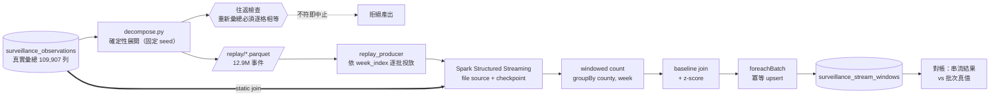

# Spark 串流分析設計

審查用文件，尚未實作。

## 1. 誠實定位：Spark 在這裡是為了什麼

**109,907 列不需要 Spark。** 單機 pandas 幾秒跑完，這件事不會因為換個說法而改變。

Spark 的正當性只有一個：**它是 CYCH 自家急診即時 feed 的架構預演。**

這句話有個直接的設計後果——**如果回放的資料形狀和未來的真實 feed 不一樣，這場預演就沒有意義**。下面第 2 節整個設計都由這一條推導出來。

## 2. 核心決策一：回放什麼

未來 CYCH 送過來的會是**一筆一筆的急診就診事件**（HL7/FHIR message 或資料庫 CDC），不是每週彙總的 CSV。

| | 回放週彙總 | 回放個別就診事件 |
|---|---|---|
| 事件數 | 109,907 | **12,943,342** |
| 形狀符合未來 feed | ❌ 完全不同 | ✅ 一筆事件 = 一次就診 |
| 需要 windowed aggregation | 幾乎不用 | ✅ 真的要 |
| 需要 watermark / 遲到處理 | 無從練起 | ✅ 真的要 |
| Spark 是否被真正使用 | 否，只是裝飾 | 是 |

**選後者。** 前者會讓整個 pipeline 變成「用 Spark 讀 CSV 再寫回去」，那不是預演。

### 這不是捏造資料——是可逆的分解

把「嘉義市 0~6 歲 2026-W32 共 347 人次」展開成 347 筆個別事件，聽起來像無中生有。
所以它必須遵守一條硬規則：

> **把展開後的事件流重新彙總，必須逐格等於疾管署的原始數字。**

這讓它成為**分解（decomposition）**而不是**發明（invention）**。而且這條性質同時
是 pipeline 的正確性檢查——我們事先就知道 Spark 應該算出什麼答案。

伴隨的紀律：

- 合成事件寫入 `source = 'cdc-rods-synthetic-replay'`，與真實的 `cdc-rods` **永不混用**
- 每筆事件帶 `synthetic = true` 欄位，下游無法「不小心」把它當真實個案
- 週內的時間分布是**確定性**的（固定 seed），同樣輸入永遠得到同樣輸出
- 年齡別、縣市、週次都來自真實資料，**只有「週內第幾秒」是合成的**

⚠️ **這個資料集永遠不得用於流行病學推論。** 它存在的唯一目的是產生正確形狀的
事件流來測試管線。文件、欄位名稱、資料表名稱都會這樣標示。

## 3. 核心決策二：event time 從哪來（本設計最棘手的部分）

Spark Structured Streaming 的 windowing 和 watermark 都建立在 event time 上。
所以每筆事件需要一個時間戳。而 `(epi_year, epi_week)` → 日曆日期的對應，
**經查證後發現無法用任何標準慣例推導**。

實測資料中有第 53 週的年份是 **2009、2014、2020、2025**。對照六種慣例：

| 慣例 | 53 週年份 | 吻合 |
|---|---|---|
| ISO 8601（週一起、4 天規則） | 2009, 2015, 2020, 2026 | ❌ |
| MMWR（週日起、4 天規則） | 2008, 2014, 2020, 2025 | ❌ |
| 週日起／含 1/1 | 2011, 2016, 2022 | ❌ |
| 週日起／首個完整週 | 2012, 2017, 2023 | ❌ |
| 週一起／含 1/1 | 2012, 2017, 2023 | ❌ |
| 週一起／首個完整週 | 2007, 2012, 2018, 2024 | ❌ |

**沒有一種吻合。** 資料同時具有 ISO 的 2009 和 MMWR 的 2014/2025——
這與「約 2010 年前後更換過慣例」一致，但那是推論，不是證據。
每一年的週數都完整（52 或 53），所以不是資料缺漏造成的。

依專案規則「**NEVER guess or force data mappings**」，這裡不能猜。

### 解法：不要從週次推導日曆日期

回放時鐘本來就是合成的（我們是把 20 年壓縮成幾分鐘播放），**絕對日曆日期
對管線的正確性毫無作用**。真正需要的性質只有一個：**window 必須與 epi week
一對一對齊**。

所以 event time 用**序號**產生，不用日曆換算：

```
week_index = (年, 週) 在排序後的相異清單中的位置       # 0, 1, 2, ...
event_time = REPLAY_EPOCH + week_index × 7 天 + 週內偏移
```

- 對齊**保證正確**（依建構即成立），不依賴任何慣例假設
- 遲到資料、watermark、window 邊界全部照常可以練
- 對人類報告時**一律沿用原始的 `epi_year` / `epi_week` 標籤**，不做任何換算，
  所以沒有標錯週次的風險

⚠️ 未來接真實 CYCH feed 時這個問題不存在——真實事件自帶時間戳。
若日後仍需要把 epi week 對到日曆日期（例如與其他資料源 join），
**必須先向疾管署查證慣例定義**，列為未解項目。

## 4. 資料結構

四層，各有明確職責。

### 4.1 來源（疾管署 RODS，唯讀）

```
年 / 週 / 年齡別 / 縣市 / 類流感急診就診人次 / 縣市別代碼
```

### 4.2 落地（已存在，`surveillance_observations`）

真實彙總，`source = 'cdc-rods'`。**Spark 不寫這張表。**

### 4.3 合成事件流（新，Spark 的輸入）

由 4.2 確定性展開，寫成分區 Parquet 檔供 Spark file source 讀取：

```
replay/
  week_index=0000/part-*.parquet
  week_index=0001/part-*.parquet
  ...
```

```python
event_id      string    # 確定性：sha1(county|age|year|week|seq)
event_time    timestamp # 見 §3，序號推導
epi_year      short
epi_week      short
county_code   string
county        string
age_group     string
disease       string
synthetic     boolean   # 恆為 true
source        string    # 恆為 'cdc-rods-synthetic-replay'
```

一筆事件 = 一次急診就診。**沒有 count 欄位**——這正是與週彙總的關鍵差異，
也是讓 Spark 真的需要做 aggregation 的原因。

### 4.4 串流輸出（新資料表）

```sql
CREATE TABLE surveillance_stream_windows (
    disease       TEXT     NOT NULL,
    county_code   TEXT     NOT NULL,
    epi_year      SMALLINT NOT NULL,
    epi_week      SMALLINT NOT NULL,
    visits        INTEGER  NOT NULL,   -- Spark 算出來的
    baseline_mean REAL,                -- 來自 static join
    baseline_sd   REAL,
    z_score       REAL,
    alert         BOOLEAN  NOT NULL,
    window_closed_at TIMESTAMPTZ NOT NULL,
    batch_id      BIGINT   NOT NULL,   -- Spark 的 microbatch id
    CONSTRAINT stream_window_key
        UNIQUE (disease, county_code, epi_year, epi_week)
);
```

`UNIQUE` 是冪等寫入的依據——Structured Streaming 在失敗重試時**會重送
同一個 microbatch**，沒有它就會重複計數。

## 5. 架構



**注意 `A ==> E` 那條**：基線（前 5 年同週分布）是 static DataFrame，
與串流做 stream-static join。這是 Structured Streaming 的標準模式，
也是未來真實 feed 會用的同一套結構。

## 6. 串流語意（真正要練的東西）

| 議題 | 設計 | 為什麼重要 |
|---|---|---|
| Checkpoint | `checkpointLocation` 落在具名 volume | 重啟後不重算、不漏算 |
| 冪等 sink | `foreachBatch` + `ON CONFLICT` upsert | microbatch 會重送 |
| Watermark | 2 個 replay 週 | 遲到資料要能歸入正確 window |
| 遲到資料 | 刻意注入超過 watermark 的事件 | 觀察它被丟棄且**有計數**，不是靜默消失 |
| Trigger | `processingTime` 可調 | 控制回放速度與 M5 負載 |
| 背壓 | `maxFilesPerTrigger` | 避免一次吃進 12.9M 事件 |

**對帳是驗收標準**：串流算出的每一格 `visits`，必須等於
`surveillance_observations` 的真值。不相等就是管線有錯——這是我們少數
「事先知道正確答案」的機會，不用白不用。

## 7. 這個設計「沒有」預演到什麼

誠實列出，避免日後誤以為已驗證：

- **不是 Kafka。** 用 file source。因此**沒有**練到 consumer group、partition
  rebalance、broker 故障。其中 consumer group 特別關鍵——那正是先前指出的
  「blue/green 對串流任務語意錯誤」的根源。M5 上再加 Kafka（約 1 GB+）
  在目前階段不划算。
- **不是真實 HL7/FHIR 解析。** 事件已經是結構化的，省略了真實院內整合最髒的一段。
- **不是真實延遲特性。** 回放是壓縮時間，不會出現真實系統的抖動與塞車。
- **單機。** Spark 的分散式 shuffle、executor 故障恢復要等上 K8s 才練得到。

## 8. 分階段

1. **decompose + 往返檢查**（無 Spark）。先確定分解是可逆的，再談串流。
2. **Spark local mode**，跑完整 pipeline，與批次真值對帳。
3. **注入故障**：中途砍掉 job 驗 checkpoint 續跑；重送 microbatch 驗冪等；
   投遲到事件驗 watermark 計數。
4. **上 K8s**（需先重建叢集：真 StorageClass + registry，現有 agent 上限
   1.465 GB 對 executor 太小）。

前三階段不需要動叢集，負載可控。

## 9. 需要決定的事

1. **回放速度**：20 年壓成幾分鐘？影響 demo 節奏與 M5 負載。建議先 5 分鐘。
2. **合成事件是否落地保存**（12.9M 筆 Parquet 約數百 MB），或每次重新產生。
   建議**不保存**——它是衍生物，且保存等於多一份可能被誤用的假資料。
3. **是否要加 Kafka**。我建議這個階段不要，理由見 §7；但如果 demo 需要
   出現「訊息佇列」這個元件，那要另外評估負載。
