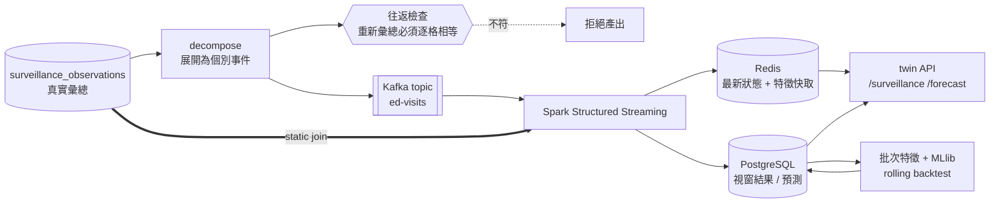

# Spark 串流分析設計

審查用，尚未實作。第二版——第一版沒有回答「預測什麼」，而且把異常偵測
（這週是否超標）誤當成預測（下週會是多少）。那是兩件事。

**地理範圍改為台中市**（中醫大資料未來進駐）。台中在資料中是
`縣市別代碼 66000`，2007–2026 連續、143 萬人次；疾管署已回溯統一縣市代碼，
**沒有 2010 年縣市合併造成的斷點**（已查證）。

---

## 1. 政府開放資料的實際結構

疾管署開放資料平台（`data.cdc.gov.tw`，CKAN API）共 73 個資料集，
與疫情監測相關的 15 個。實際下載並檢視後，**分成兩個家族，結構不同**：

### 1.1 RODS 家族——急診症候群監測

`https://od.cdc.gov.tw/eic/RODS_Influenza_like_illness.csv`

| 欄位 | 範例 |
|---|---|
| 年 | 2026 |
| 週 | 32 |
| 年齡別 | `0~6` `7~12` `13~18` `19~64` `65+`（5 組）|
| 縣市 | 台中市 |
| **類流感急診就診人次** | 347 |
| 縣市別代碼 | 66000 |

- 109,907 列，**2007–2026（20 年）**
- **只有分子，沒有分母**
- 同家族另有 `RODS_COVID-19.csv`（13,713 列，2022 起）

### 1.2 NHI 家族——健保就診統計

`https://od.cdc.gov.tw/eic/NHI_Influenza_like_illness.csv`

| 欄位 | 範例 |
|---|---|
| 年 / 週 | 2026 / 32 |
| **就診類別** | `門診` `住院`（**沒有急診**）|
| 年齡別 | `0~2` `3~6` `7~12` `13~15` `16~18` `19~24` `25~64` `65+` `不詳`（9 組）|
| 縣市 | 台中市 |
| 類流感健保就診人次 | 13,996 |
| **健保就診總人次** | 741,507 |
| 縣市別代碼 | 66000 |

- 187,908 列，**2016–2026（11 年）**
- **有分母**——這是關鍵差異
- 同家族有腸病毒、COVID、腹瀉、肺炎等多種疾病，欄位結構一致

### 1.3 兩個家族不能直接 join（實測）

| | RODS | NHI |
|---|---|---|
| 年份 | 2007–2026 | 2016–2026 |
| 年齡分組 | 5 組 | 9 組，**切點完全不同** |
| 就診類別 | 急診 | 門診 / 住院 |
| 分母 | 無 | 有 |

年齡分組 `0~6` 與 `0~2`+`3~6` 可以對上，但 `19~64` 與 `19~24`+`25~64` 也可以——
**其餘切點對不上**（`13~18` vs `13~15`+`16~18` 可以，但 RODS 沒有 `不詳`）。
要合併必須降到最粗的共同分組，會丟掉解析度。

**決定：不合併。** 兩者當作兩個獨立訊號來源餵給模型，各自保留原始解析度。

### 1.4 分母為什麼重要（實測）

台中市門診，近 8 週：

```
2026-W29   12,031 / 746,321 = 1.61%
2026-W30   13,031 / 740,477 = 1.76%
2026-W31   13,564 / 722,443 = 1.88%
2026-W32   13,996 / 741,507 = 1.89%
```

**分子與分母的相關係數 = 0.671。** 就診總量本身就在波動（連假、疫情期間
就醫行為改變、健保政策）。只看原始人次，會把「看病的人變多」誤判成
「流感變多」。

所以**預測目標用佔比，不用原始人次**。這是公衛界的標準做法（等同美國 CDC 的 %ILI）。

---

## 2. 我們要預測什麼

> **未來 1 週與 2 週，台中市門診類流感就診佔比（%ILI）。**

```
目標  y(t+1), y(t+2)  =  類流感健保就診人次 / 健保就診總人次   （台中市，門診）
```

### 為什麼是這個

| 候選 | 為何不選 |
|---|---|
| 原始就診人次 | 分母會漂移，見 §1.4 |
| 「是否爆發」二元分類 | 爆發罕見、標籤主觀，且醫院要的是量能數字不是布林值 |
| 全國各縣市 | 先把一個縣市做對；台中有 143 萬人次、訊號足夠 |
| 4 週以上 | 週資料落後 2 週，再往後推可信度快速下降 |

**1–2 週對醫院是可行動的**：急診／門診人力排班、床位與抗病毒藥物備量，
前置期正好在這個區間。

### 這與「異常偵測」的差別

第一版做的 historical limits 是**回顧**：這週有沒有超出歷史範圍。
預測是**前瞻**：下週會是多少。兩者都保留，因為它們回答不同問題——
但這次的主軸是後者。

### 特徵（全部可在預測時點取得，無未來資訊洩漏）

```
lag_1..lag_4          前 1–4 週的 %ILI
delta_1               lag_1 - lag_2（近期斜率）
same_week_last_year   去年同週 %ILI
seasonal_index        該 epi week 的歷史中位數（僅用訓練期資料計算）
week_of_year          季節性
denominator_lag_1     前一週就診總量（就醫行為的代理變數）
covid_lag_1           同期 COVID 佔比（跨疾病干擾／競爭）
entero_lag_1          同期腸病毒佔比
age_share_0_6_lag_1   幼童就診佔比（學校群聚的早期訊號）
```

⚠️ `seasonal_index` **只能用訓練期資料計算**。用全期資料算再回頭當特徵，
是最常見的洩漏形式，會讓 backtest 分數虛高而上線後崩掉。

### 驗收標準（沒有這個就是自我感覺良好）

必須贏過兩個**天真基準**：

1. `y(t+1) = y(t)`（持平）
2. `y(t+1) = 去年同週值 × 今年趨勢`（季節天真）

**時間序列切分，不是隨機切分。** 隨機切分會把未來混進訓練集，
分數會很漂亮而且完全沒有意義。用 rolling-origin backtest：
訓練到第 t 週 → 預測 t+1 → 前推一週 → 重複。

指標：MAE、MAPE、以及**方向準確率**（升／降預測對不對）——
對排班決策而言方向常比絕對值更有用。

---

## 3. Spark 到底怎麼用（第一版沒講清楚的部分）

三個階段，各自用到 Spark 的不同能力。

### 3.1 Structured Streaming——即時彙總與偵測

```python
events = (spark.readStream
    .format("kafka")
    .option("subscribe", "ed-visits")
    .load()
    .select(from_json(col("value").cast("string"), EVENT_SCHEMA).alias("e"))
    .select("e.*")
    .withWatermark("event_time", "2 weeks"))

# 1) 事件 → 週彙總。這是 Spark 真正在做事的地方：
#    12.9M 筆事件收斂成 (縣市 × 週) 的計數。
weekly = (events
    .groupBy(window(col("event_time"), "7 days"), col("county_code"))
    .agg(count("*").alias("visits"),
         sum(when(col("is_ili"), 1).otherwise(0)).alias("ili_visits")))

# 2) stream-static join：基線是批次算好的 static DataFrame
baseline = spark.read.jdbc(PG_URL, "surveillance_baseline")
scored = weekly.join(broadcast(baseline), ["county_code", "epi_week"]) \
               .withColumn("z", (col("ili_rate") - col("mean")) / col("sd"))

# 3) 冪等 sink
scored.writeStream \
      .foreachBatch(upsert_to_postgres) \
      .option("checkpointLocation", CHECKPOINT) \
      .trigger(processingTime="5 seconds") \
      .start()
```

用到的 Spark 能力：**watermark、event-time window、stream-static join
（broadcast）、foreachBatch 冪等寫入、checkpoint 續跑**。

### 3.2 批次特徵工程——Window functions

```python
w = Window.partitionBy("county_code").orderBy("week_index")

feat = (obs
    .withColumn("ili_rate", col("ili_visits") / col("total_visits"))
    .withColumn("lag_1", lag("ili_rate", 1).over(w))
    .withColumn("lag_2", lag("ili_rate", 2).over(w))
    .withColumn("lag_4", lag("ili_rate", 4).over(w))
    .withColumn("delta_1", col("lag_1") - col("lag_2"))
    .withColumn("same_week_last_year", lag("ili_rate", 52).over(w))
    .withColumn("y_next", lead("ili_rate", 1).over(w)))    # 標籤
```

`lag` / `lead` / `Window` 是 Spark SQL 的核心，也是這套語法**原封不動**
可以擴展到多縣市、多疾病的原因。

### 3.3 MLlib——訓練與 backtest

```python
from pyspark.ml.regression import GBTRegressor
from pyspark.ml.feature import VectorAssembler
from pyspark.ml import Pipeline

pipeline = Pipeline(stages=[
    VectorAssembler(inputCols=FEATURES, outputCol="features"),
    GBTRegressor(labelCol="y_next", featuresCol="features",
                 maxIter=60, maxDepth=4, seed=42),   # seed 固定 → 可重現
])

# Rolling-origin backtest：一定要按時間切
for cutoff in backtest_weeks:
    train = feat.filter(col("week_index") <= cutoff)
    test  = feat.filter(col("week_index") == cutoff + 1)
    model = pipeline.fit(train)
    preds = model.transform(test)
```

⚠️ **會刻意寫錯一次再修正**：先用 `randomSplit` 跑一遍，記錄那個
虛高的分數，再換成時間切分，把兩者並列在證據裡。這是最容易犯、
也最難從結果看出來的錯誤，值得留下對照。

---

## 4. Kafka 與 Redis 的角色

「殺雞用牛刀」成立，目的是練習，並且讓 pilot 頭尾串起來。但即使如此，
每個元件仍必須有一個**說得出口的職責**，否則就是擺著好看。



### Kafka：`ed-visits` topic

- **職責**：事件傳輸與重播。取代第一版的 file source。
- **練到的東西**：consumer group、offset 管理、partition（依 `county_code` 分區）、
  Spark 的 `startingOffsets` 與 checkpoint 交互作用。
- **為什麼值得**：consumer group 正是先前指出「blue/green 對串流任務語意錯誤」
  的根源——兩個顏色同時消費會分走 partition。**這是唯一能真正練到那個問題的方式**，
  而那個問題會在 K8s 上再次出現。
- 單機 KRaft 模式（不需要 ZooKeeper），1 broker。

### Redis：最新狀態與特徵快取

- **職責**：
  1. 每個縣市的**最新視窗結果**（API 讀這裡，不打 PostgreSQL）
  2. **預測用的特徵向量快取**（lag 特徵每週才變一次，重算浪費）
  3. Spark 與 API 之間的**去耦**——API 不必等 Spark 寫完 DB
- **練到的東西**：cache invalidation、TTL、以及「快取與真值不一致」
  這個經典問題——我會刻意注入不一致並驗證能偵測到。
- ⚠️ **Redis 不是真值來源。** PostgreSQL 才是。Redis 掛掉時 API 必須
  降級去讀 PostgreSQL，而不是回報無資料——這一點會實測。

### 誠實的負載評估

| 元件 | 記憶體 |
|---|---|
| Kafka（KRaft，1 broker） | ~1.0 GB |
| Redis | ~0.1 GB |
| Spark driver + 2 executors | ~2.5 GB |
| 現有 Compose 平台 | ~0.5 GB |
| k3d 練習叢集 | ~4.0 GB（可先 `k3d cluster stop`） |

Docker VM 上限 15.6 GB。全開約 8 GB，**可行但不寬裕**；
練 Spark 時建議先停 k3d，兩者不需要同時跑。

---

## 5. 合成事件流：分解而非發明

RODS 的 109,907 列彙總展開成 **12,943,342 筆個別就診事件**，因為未來 CYCH／
中醫大送來的是一筆一筆的就診，不是週彙總。回放彙總等於「用 Spark 讀 CSV
再寫回去」，練不到任何東西。

硬規則：**重新彙總必須逐格等於原始數字。** 這讓它是分解不是發明，
而且同時是管線的正確性檢查——我們事先知道答案。

紀律：`source='cdc-rods-synthetic-replay'`、每筆帶 `synthetic=true`、
固定 seed、**只有「週內第幾秒」是合成的**。
⚠️ 此資料集永不得用於流行病學推論。

---

## 6. 關於 window 與資料來源的確認

第一版發現 `(年, 週)` 無法用任何標準慣例換算成日曆日期
（資料的 53 週年份是 2009/2014/2020/2025，六種慣例全部不吻合）。

**你要求確認資料來源，這是對的。** 我原本的做法是繞過它（用序號當回放時鐘），
那對回放管線正確，但**不能解決「未來要和其他資料源 join」的問題**——
中醫大的資料進來時，一定要能對到同一個時間軸。

所以列為**必須向疾管署查證的項目**，不再只是繞過：

- [ ] 疾管署「流行病學週」的正式定義（起始日、第 1 週判定規則）
- [ ] 是否曾變更慣例（資料同時具 ISO 的 2009 與 MMWR 的 2014/2025，
      與「約 2010 年前後更換」一致，但那是推論不是證據）

在查證完成前，回放時鐘用序號，且**所有對外報表一律沿用原始
`epi_year`/`epi_week` 標籤，不做任何換算**。

---

## 7. 分階段

1. **decompose + 往返檢查**（無 Spark、無 Kafka）。分解可逆才有後面。
2. **Kafka + Redis 起服務**，producer 灌事件，驗 offset 與 consumer group。
3. **Spark Structured Streaming**，串流結果與批次真值**逐格對帳**。
4. **故障注入**：砍 job 驗 checkpoint、重送 microbatch 驗冪等、
   遲到事件驗 watermark 有計數、Redis 掛掉驗 API 降級。
5. **批次特徵 + MLlib backtest**，含刻意的 `randomSplit` 錯誤對照。
6. **上 K8s**（需重建叢集：真 StorageClass + registry；現有 agent 上限
   1.465 GB 對 executor 太小）。

---

## 8. 尚待確認

1. 回放速度：20 年壓成幾分鐘？建議 5 分鐘。
2. 合成事件是否落地保存（約數百 MB）？**建議不保存**——衍生物，
   且保存等於多一份可能被誤用的假資料。
3. 中醫大資料的形狀與時間軸為何？會決定 §6 的查證優先度。
